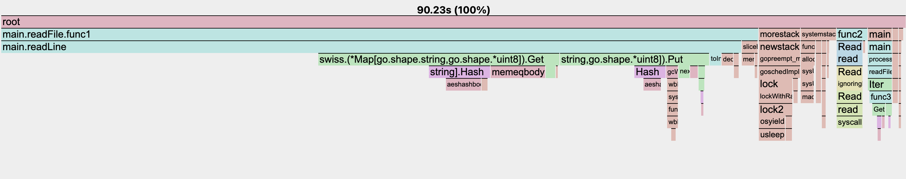

# 1brc

Golang solution for the [1brc challenge](https://github.com/gunnarmorling/1brc).

## Approach

- Split the file into chunks for parallel reading.
- Parse the chunks simultaneously.
- Monitor the chunks and compute the average.
- Arrange the data in alphabetical order based on the name.
- Display the calculated average.

## Usage

- build the binary
```zsh
go build
```

- run the binary
```zsh
1brc <path to the measurement file>
```

## Performance
Average Time taken: `14.8s`

**NOTE**: The time taken is with a MacBook M2 Pro.

CPU flame graph:

